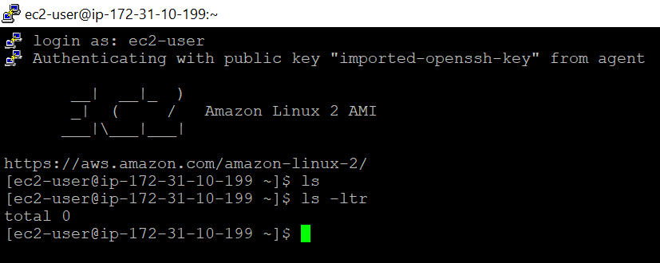

1. https://portal.aws.amazon.com/billing/signup#/start
1. Foow the wizard and create account
1. signin to account
1. observe biling info https://console.aws.amazon.com/billing/home?#/account
1. Services > EC2 > Launch instance > Amazon Linux 2 AMI (HVM), SSD Volume Type > Select > Review and Launch > Launch
1. Select New Key pair > Download Key pair and save it in local machine
1. Open putty gen > load above file > save private key 
1. Copy IPv4 Public IP > open putty > enter ip > provide username as **ec2-user**

    
1. 

